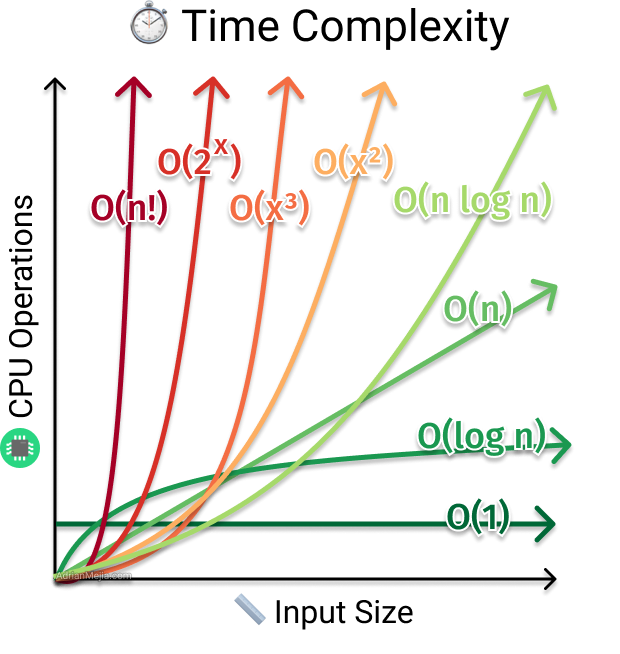

# Complexidade

Maior parte do esforço em programação competitiva é destinado a deixar o algoritmo mais rápido. Como dito antes, sua solução precisa gerar a saída correta e também respeitar os limites de tempo e memória.

Para otimizar nosso código, geralmente começamos pela **complexidade**. A complexidade é uma estimativa da quantidade de passos que seu programa realiza.

Vamos considerar um passo como sendo uma operação básica do computador. Exemplo de operações que vamos considerar como um passo:

* Uma soma;
* Uma leitura de variável;
* Uma multiplicação;
* Uma atribuição;
* Uma verificação de condição;
* Um retorno;

Note que existem operações que são mais lentas que outras em um computador (somar é mais rápido que dividir), mas vamos considerar toda **operação com tempo constante** sendo um passo para simplificar nossa vida. Fazemos isso pois é muito difícil estimar o tempo exato de cada operação.

Podemos então contar o número de passos do nosso código.

### Exemplo 1 
```cpp
int main() {
    int a = 1; // 1 passo
    int b = 2; // 1 passo

    int c = a + b; // 2 passos (soma e atribuição)

    cout << c; // 1 passo
}
```

Nesse exemplo acima temos um total de 5 passos.

### Exemplo 2
```cpp
int main() {
    int n = 10;

    // passos do FOR:
    //   1 passo para inicializar
    //   11 passos para verificar a condição
    //   10 passos para incrementar
    for(int i = 0; i < n; i++) { 
        cout << i << endl; // 2 passos que se repetem 10 vezes
    }>)
}```

No exemplo acima temos um total de 1 + 11 + 10 + (2*10) = 42 passos.

### Exemplo 3
```cpp
int main() {
    int n;
    cin >> n;
    // passos do FOR:
    //   1 passo para inicializar
    //   n+1 passos para verificar a condição
    //   n passos para incrementar
    for(int i = 0; i < n; i++) {
        cout << i << endl; // 2 passos que se repetem n vezes
    }
}
```

No exemplo acima temos um total de 1 + (n+1) + n + (2\*n) = 4\*n + 2 passos. Quando calculamos o número de passos de acordo com o valor de uma ou mais variáveis, chamamos essa função de **função de complexidade**. No caso acima, a função de complexidade é $f(n) = 4n + 2$.

### Exemplo 3

```cpp
int main() {
    int n;
    cin >> n;
    // passos do FOR externo:
    //   1 passo para inicializar
    //   n+1 passos para verificar a condição
    //   n passos para incrementar
    for(int i = 0; i < n; i++) { 
        // passos do FOR interno:
        //   1 passo para inicializar
        //   n+1 passos para verificar a condição
        //   n passos para incrementar
        for(int j = 0; j < n; j++) { 
            cout << i << " " << j << endl; // 3 passos que se repetem n*n vezes
        }
    }
}
```

No exemplo acima temos um total de 1 + (n+1) + n + (1 + (n+1) + n) + (3\*n\*n) = 4\*n\*n + 4*n + 2 passos. A função de complexidade é $f(n) = 4n^2 + 4n + 2$.

Não se preocupe muito em acertar a quantidade exata de passos, precisamos apenas de uma estimativa. Ainda vamos simplificar ainda mais essa função usando a notação assintótica.


## Notação assintótica

A notação assintótica é uma forma de simplificar a função de complexidade. A notação mais comum é o $O$-grande (big O) que dá um limite superior para o número de passos.


Por exemplo, se temos a função $f(n) = 4n^2 + 4n + 2$, podemos simplificá-la para $f(n) = O(n^2)$. Para isso, fazemos dois passos:

1. Ignoramos as constantes multiplicativas;
2. Em uma soma, ignoramos os termos menores.


Considere a função $f(n) = 4n^2 + 4n + 2$. Primeiro ignoramos as constantes multiplicativas:

$f(n) = O(f(n))$

$f(n) = O(4n^2 + 4n + 2)$

$f(n) = O(n^2 + n + 1)$

Agora temos uma soma de termos, desses três há apenas um termo dominante. A intuição é que $n^2$ cresce muito mais rápido que $n$ e $1$ quando $n$ é grande. Então, ignoraramos os demais termos.

$f(n) = O(f(n))$

$f(n) = O(4n^2 + 4n + 2)$

$f(n) = O(n^2 + n + 1)$

$f(n) = O(n^2)$

Alguns complexidades comuns ordenados do menor para o maior: 

$O(1) < O(log(n)) < O(\sqrt{n}) < O(n) < O(n * log(n)) < O(n^2) < O(n^3) < O(2^n) < O(n!)$

Essa diferença pode ser observada no gráfico abaixo. Note que estamos interessados no crescimento da função, ou seja, na curva da função quando $n$ é grande.




## Mais exemplos

#### Notação assintótica de funções de complexidade:

$f(1000) = O(1)$

$f(3n + 200) = O(n)$

$f(5n^2 + 0.0001n^3 + 10000) = O(n^3)$

$f(2n + 4m) = O(n + m)$

$f(4n + 6n + 2nm) = O(nm)$, se considerarmos que $n$ e $m$ são maiores que zero.

$f(n.log(n) + 6n\sqrt{n}) = O(n\sqrt{n})$


$f(2^n + 5n^{1000}) = O(2^n)$


#### Complexidade de algoritmos:

```cpp
// Imprimir de 0 até n-1
for(int i = 0; i < n; i++){
    cout << i << endl;
}
// Complexidade: O(n)
```

```cpp
// Verificar se o número n é primo
primo = 1;
for(int i = 2; i*i <= n; i++){
    if(n % i == 0){
        primo = 0;
        break;
    }
}
// Complexidade: O(√n)
```

```cpp
// Leitura e ordenação com bubble sort
for(int i = 0; i < n; i++){
    cin >> arr[i];
}

for(int i = 0; i < n-1; i++){
    for(int j = 0; j < n-i-1; j++){
        if(arr[j] > arr[j+1]){
            swap(arr[j], arr[j+1]);
        }
    }
}
// Complexidade O(n^2)
```

```cpp
// Soma de 1 até n
int somatorio(int n){
    return (n*(n+1))/2;
}
// Complexidade: O(1)
```

```cpp
// Busca sequencial pelo indice

int busca(int arr[], int n, int x){
    for(int i = 0; i < n; i++){
        if(arr[i] == x){
            return i;
        }
    }
    return -1;
}
// Complexidade: O(n)
```


```cpp
// Busca binaria, funciona apenas se o vetor estiver ordenado

int busca_binaria(int arr[], int n, int x){
    int esq = 0, dir = n-1;

    while(esq <= dir){
        int meio = (esq + dir)/2;
        if(arr[meio] == x){
            return meio;
        }else if(arr[meio] < x){
            esq = meio + 1;
        }else{
            dir = meio - 1;
        }
    }
    return -1;
}
// Complexidade: O(log(n))
```

