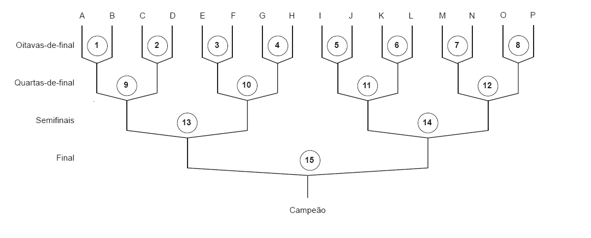

# Copa do mundo

Fonte: [https://olimpiada.ic.unicamp.br/pratique/p1/2010/f1/copa/](https://olimpiada.ic.unicamp.br/pratique/p1/2010/f1/copa/)

Este ano tem Copa do Mundo! O país inteiro se prepara para torcer para a equipe canarinho conquistar mais um título, tornando-se hexacampeã.

Na Copa do Mundo, depois de uma fase de grupos, dezesseis equipes disputam a Fase Final, composta de quinze jogos eliminatórios. A figura abaixo mostra a tabela de jogos da Fase Final:



---

### Tarefa

Escreva um programa que determine a equipe campeã a partir dos resultados dos 15 jogos eliminatórios.

### Entrada

A entrada é composta de quinze linhas, cada uma contendo o resultado de um jogo. A primeira linha contém o resultado do jogo de número 1, a segunda linha o resultado do jogo de número 2, e assim por diante. 

O resultado de um jogo é representado por dois números inteiros $M$ e $N$ separados por um espaço em branco, indicando respectivamente o número de gols da equipe representada à esquerda e à direita na tabela de jogos ($0 \le M \le 20$, $0 \le N \le 20$ e $M \ne N$).

### Saída

Seu programa deve imprimir uma única linha, contendo a letra identificadora da equipe campeã.

---

### Exemplos

#### Exemplo 1

**Entrada:**
```text
4 1
1 0
0 4
3 1
2 3
1 2
2 0
0 2
1 2
4 3
0 1
3 2
3 4
1 4
1 0
```

**Saída:**
```text
F
```

---

#### Exemplo 2

**Entrada:**
```text
2 0
1 0
2 1
1 0
1 0
1 2
1 2
1 0
2 1
2 1
1 0
2 1
2 1
1 0
2 1
```

**Saída:**
```text
A
```