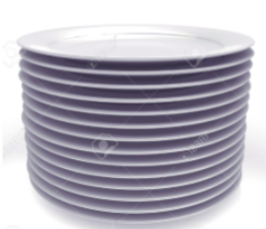
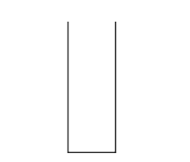
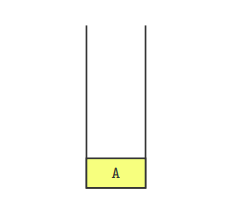
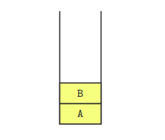
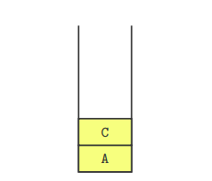
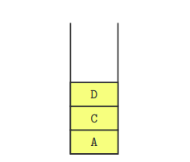

## Introdução

Imagine que você está em um restaurante *self-service*, e vê uma pilha de pratos limpos.

<!-- TODO: centralizar imagem -->

<div align="center">
  
</div>


É esperado que o cliente tenha acesso e retire o prato que está acima, pois é o mais fácil de ser removido.
Ao mesmo tempo, o funcionário do restaurante precisa repor os pratos, e ele também só coloca os pratos limpos no topo dessa mesma pilha.


A pilha em ED é uma estrutura que simula o comportamento acima: só é possível acessar, inserir ou remover elementos de um topo.

Nesse tutorial, veremos:

1. O que é a pilha.
2. Operações básicas da pilha.
3. Implementação em C++.
4. Utilidades.


## Pilha

A Pilha é umas das estruturas de dados mais simples. Ela é coleção linear (seus elementos são organizados em sequência) e apenas permite acessar elementos de um único ponto.
A pilha é também denominada de estrutura LIFO (Last In, First Out). Traduzindo, o último elemento a ser inserido é o primeiro a ser removido.

A pilha tem o seu topo, que indica qual foi o último elemento inserido. Quando um novo elemento é inserido, ele passa a ser o novo topo da pilha. Quando um elemento é removido, o topo passa a ser o elemento que foi inserido anteriormente.

Além disso, geralmente só é permitido acessar esse elemento do topo.

#### Operações básicas da pilha


* Acessar o elemento do topo;
* Inserir um novo elemento no topo;
* Remover o elemento do topo.

Além disso, podemos ter outras operações, como:

* Verificar se a pilha está vazia;
* Obter o tamanho da pilha;
* Esvaziar a pilha.

## Exemplo

Considere uma pilha inicialmente vazia:



Inserimos um novo elemento A no topo da pilha (topo: A):



Inserimos um novo elemento B no topo da pilha (topo: B):



Removemos o elemento do topo da pilha (topo: A):


Inserimos um novo elemento C no topo da pilha (topo: C):



Inserimos um novo elemento D no topo da pilha (topo: D):



Removemos o elemento do topo da pilha (topo: C):


## Implementação em C++

A biblioteca padrão do C++ já tem uma implementação de pilha (*stack*).

Operações:

* `stack<T> pilha;` declara uma pilha de elementos do tipo `T`;
* `pilha.push(x);` insere o elemento `x` no topo da pilha;
* `pilha.pop();` remove o elemento do topo da pilha;
* `pilha.top();` retorna o elemento do topo da pilha;
* `pilha.empty();` retorna 1 se a pilhas está vazia ou 0 caso contrário;
* `pilha.size();` retorna o tamanho da pilha;

#### Exemplo do uso de pilhas em C++:

```cpp
#include <bits/stdc++.h>
using namespace std;

int main() {
    stack<int> pilha; // pilha: []>

    pilha.push(1); // pilha: [1]>
    pilha.push(2); // pilha: [1, 2]>
    pilha.push(3); // pilha: [1, 2, 3]>

    cout << "Topo da pilha: " << pilha.top() << endl;
    // Saída: Topo da pilha: 3

    pilha.pop(); // pilha: [1, 2]>

    cout << "Topo da pilha" << pilha.top() << endl;
    // Saída: Topo da pilha: 2

    pilha.push(4); // pilha: [1, 2, 4]>
    pilha.push(5); // pilha: [1, 2, 4, 5]>

    cout << "Topo da pilha: " << pilha.top() << endl;
    // Saída: Topo da pilha: 5

    cout << "Tamanho da pilha: " << pilha.size() << endl;
    // Saída: Tamanho da pilha: 4

    if(pilha.empty()) {
        cout << "A pilha está vazia" << endl;
    } else {
        cout << "A pilha não está vazia" << endl;
    }
    // Saída: A pilha não está vazia

    // Vamos esvaziar a pilha
    while(!pilha.empty()){
        pilha.pop();
    }
    // pilha: []>
    
    cout << "Tamanho da pilha: " << pilha.size() << endl;
    // Saída: Tamanho da pilha: 0
}

```


## Utilidades

Pilhas são utilizadas em diversas situações na computação:

* Pilhas são utilizadas para percorrer grafos e árvores.
* Pilhas são estruturas auxiliares em outros algoritmos da maratona.
* Pilhas são utilizadas por compiladores para avaliar o código e expressões matemáticas;
* O versionamento utiliza pilhas para armazenar alterações e permitir desfazer alterações (famoso "ctrl+z");
* O SO implementa a chamada de funções através de pilhas (pilha de execução);