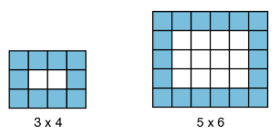

# Atlanta

Fonte: OBI 2016 - [https://olimpiada.ic.unicamp.br/pratique/pj/2020/f3/atlanta/](https://olimpiada.ic.unicamp.br/pratique/pj/2020/f3/atlanta/)


## Descrição

Documentos recentemente encontrados por pesquisadores mostram que na Sala de Audiências do palácio Real na cidade perdida de Atlanta o piso era formado por ladrilhos 20 cm x 20 cm. Ladrilhos de duas cores foram usados: o centro da Sala era formado por ladrilhos brancos e exatamente uma fileira de ladrilhos azuis foram colocados em cada lateral do Sala, como nas figuras abaixo.



Os pesquisadores não encontraram vestígios da Sala de Audiências (nem da cidade de Atlanta!), mas os documentos recentes, se forem autênticos, indicam também a quantidade de ladrilhos que foram utilizados no piso da Sala.

Sua tarefa é, dadas as quantidades de azulejos azuis e brancos, determinar as dimensões da Sala de Audiências.

## Entrada

A primeira linha da entrada contém um inteiro A, o número de azulejos azuis. A segunda linha contém um número inteiro B, o número de azulejos brancos.

## Saída

Seu programa deve produzir uma única linha, contendo dois números inteiros, representando as dimensões da Sala (largura e comprimento). Se a largura for diferente do comprimento, seu programa deve imprimir primeiro a menor dimensão, seguida da maior dimensão. Se as quantidades de azulejos não forem corretas para construir o piso da Sala no formato descrito acima, seu programa deve imprimir "-1 -1".

## Restrições

* $1 \leq A \leq 10^6$
* $1 \leq B \leq 10^6$


## Exemplo 1

**Entrada**
```text
10
2
```

**Saída**
```text
3 4
```


## Exemplo 2

**Entrada**
```text
8
2
```

**Saída**
```text
-1 -1
```


## Exemplo 3

**Entrada**
```text
3996
996004
```

**Saída**
```text
1000 1000
```